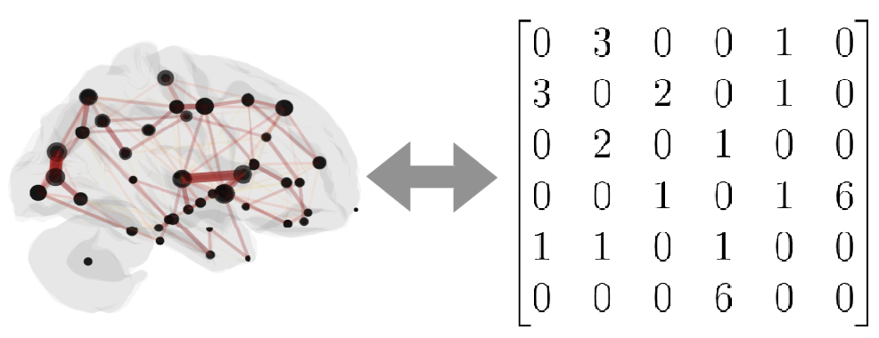
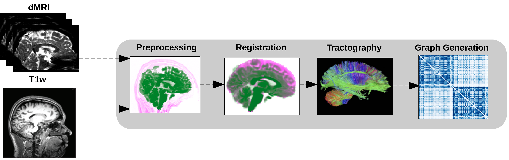
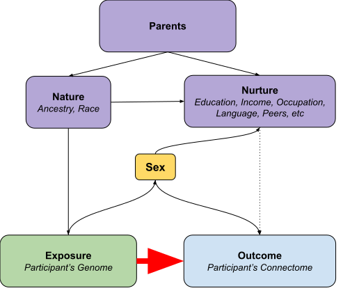
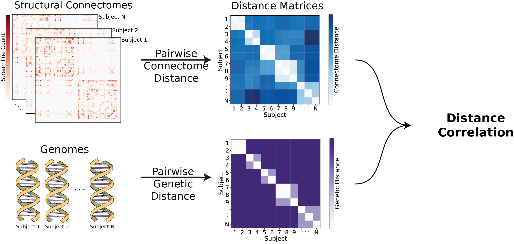
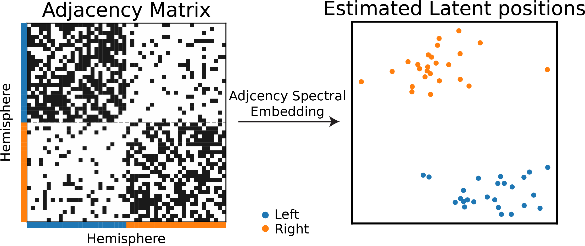
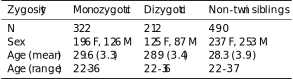
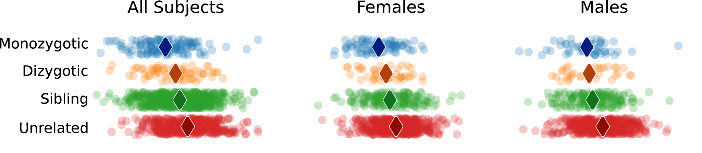
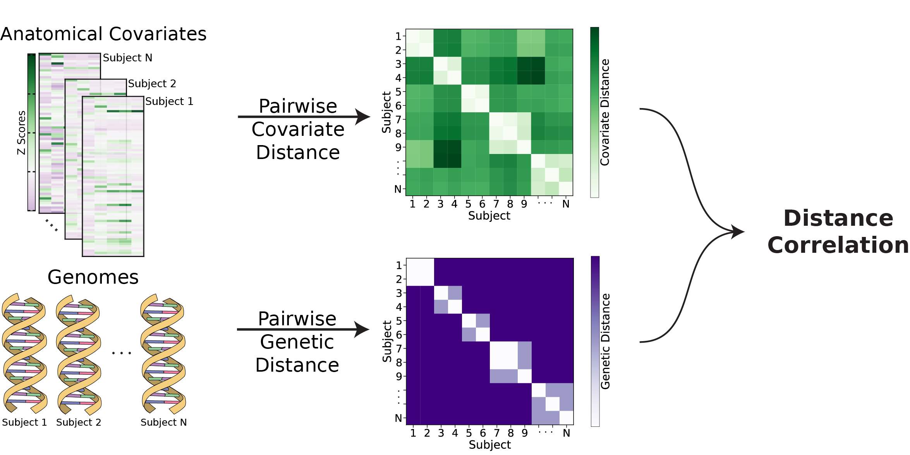
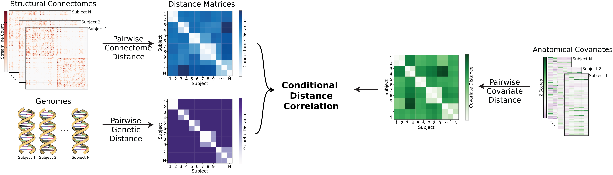
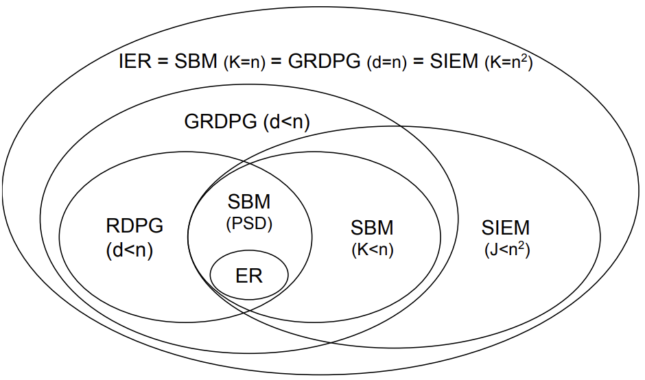

# Heritability of Human Structural Connectomes

## Jaewon Chung

_(he/him)_ - [NeuroData lab](https://neurodata.io/)
_Johns Hopkins University - Biomedical Engineering_

 [_j1c@jhu.edu_](mailto:j1c@jhu.edu)
 [_@j1c (Github)_](https://github.com/j1c)
 [_@j1c (Twitter)_](https://twitter.com/j1c)

---

# What is heritability?

- Variations in phenotype caused by variations in genotype.
- Potentially discover relationships between diseases and genetics.

     

## Are the patterns of brain connectivity heritable?

---

# Brain connectivity as connectomes

<!--  -->

(aka networks or graphs)

- Vertex: region of the brain
- Edges: connectivity measure between a pair of vertices
- Structural connectomes: estimated # of neuronal fibers
- Undirected: neurons have no direction

<footer>
Image from Gu, Zijin, et al. "Heritability and interindividual variability of regional structure-function coupling." (2021)
</footer>

---

# How do we get structural connectomes?

 

---

# Heritability as causal problem

- Directed acyclic graph

---

# Do genomes affect connectomes?

- Our hypothesis:
  $H_0: F($Connectome|Genome$) = F($Connectome$)$
  $H_A: F($Connectome|Genome$) \neq F($Connectome$)$

- Alternatively:
  $H_0: F($Connectome, Genome$) = F($Connectome$)F($Genome$)$
  $H_A: F($Connectome, Genome$) \neq F($Connectome$)F($Genome$)$

- Known as independence testing
- Test statistic: _distance correlation (dcorr)_
- Implication if false: there exists an associational heritability.

---

# What is distance correlation?

- Measures dependence between two multivariate quantities.
  - For example: connectomes, genomes.
- Can detect nonlinear associations.
- Measures correlation between pairwise distances.

---

# How to compare genomes?

- Typical twin studies do not sequence genomes.
- Coefficient of kinship ($\phi_{ij}$)
  - Probabilities of finding a particular gene at a particular location.
- d(Genome$_i$, Genome$_j$) = 1 - 2$\phi_{ij}$.

 

|   Relationship    |  $\phi_{ij}$  | $1-2\phi_{ij}$ |
| :---------------: | :-----------: | :------------: |
|    Monozygotic    | $\frac{1}{2}$ |      $0$       |
|     Dizygotic     | $\frac{1}{4}$ | $\frac{1}{2}$  |
| Non-twin siblings | $\frac{1}{4}$ | $\frac{1}{2}$  |
|     Unrelated     |      $0$      |      $1$       |

---

# How to compare connectomes?

- Random dot product graph (RDPG)
  - Each vertex (region of interest) has a low $d$ dimensional latent vector (position).
  - Estimate latent position matrix $X$ via adjacency spectral embedding.
  <!-- - $P[i\rightarrow j]$ = $\langle x_i, x_j\rangle$ -->

- d(Connectome$_k$, Connectome$_l$) = $||X^{(k)} - X^{(l)}R||_F$

---

# Human Connectome Project

- Brain scans from identical (monozygotic), fraternal (dizygotic), non-twin siblings.
- Regions defined using Glasser parcellation (180 regions).

 

<footer>
Van Essen, David C., et al., The WU-Minn human connectome project: an overview (2013)

Glasser, Matthew F., et al. "A multi-modal parcellation of human cerebral cortex." Nature (2016).

</footer>

---

# Genome and connectomes are dependent

 

   

|   Sex   |      **All**      |    **Females**    |     **Males**     |
| :-----: | :---------------: | :---------------: | :---------------: |
| p-value | $<1\times10^{-5}$ | $<1\times10^{-3}$ | $<1\times10^{-2}$ |

---

# Neuroanatomy (effect mediator)

- Literature show neuroanatomy (e.g. brain volume) is highly heritable.
- Want to test
  $H_0: F($Neuroanatomy, Genome$) = F($Neuroanatomy$)F($Genome$)$
  $H_A: F($Neuroanatomy, Genome$) \neq F($Neuroanatomy$)F($Genome$)$
- d(Neuroanatomy$_i$, Neuroanatomy$_j$) = ||Neuroanatomy$_i$ - Neuroanatomy$_j$||$_F$

---

# Genome and neuroanatomy are dependent

 

   

|   Sex   |      **All**      |    **Females**    |     **Males**     |
| :-----: | :---------------: | :---------------: | :---------------: |
| p-value | $<1\times10^{-3}$ | $<1\times10^{-2}$ | $<1\times10^{-2}$ |

---

# DAG including interactions of neuroanatomy

---

# Do genomes affect connectomes given neuroanatomy?

- Want to test:
  $H_0: F($Conn., Genome|Neuro.$) = F($Conn.|Neuro.$)F($Genome|Neuro.$)$
  $H_A: F($Conn., Genome|Neuro.$) \neq F($Conn.|Neuro.$)F($Genome|Neuro.$)$
- Known as conditional independence test
- Test statistic: Conditional distance correlation (cdcorr)
- Implication if false: there exists causal dependence of connectomes on genomes.

---

# What is conditional distance correlation?

- Augment distance correlation procedure with third distance matrix.

 

---

# Connectomes are still dependent on genome

- All tests are significant.
     

|   Sex   |      **All**      |    **Females**    |     **Males**     |
| :-----: | :---------------: | :---------------: | :---------------: |
| p-value | $<1\times10^{-2}$ | $<1\times10^{-2}$ | $<1\times10^{-2}$ |

---

# Summary

- Present a causal model for heritability of connectomes.
- Leveraged recent advances:
  1. Statistical models for networks, allowing meaningful comparison of connectomes.
  2. Distance and conditional distance correlation as test statistic for causal analysis$^1$.
- Connectomes are dependent on genome, suggesting heritability.

<footer>

$^1$ Bridgeford, Eric W., et al. "Batch Effects are Causal Effects: Applications in Human Connectomics." (2021).

</footer>

<!-- ---
# Acknowledgements

#### Team

Mike Powell

Eric Bridgeford

Carey Priebe

Joshua Vogelstein

 -->

---

         

# Additional slides

---

# Causal model

- $X$ denote exposure, $Y$ denote outcome, $W$ denote measured covariates, $Z$ denote unmeasured covariates
- Want to estimate the effect of different exposures on the outcome, which is quantified using the backdoor formula if $W$ and $Z$ close all backdoor paths.
  $$f_{w, z}(y|x) = \int_{\mathcal{W}\times\mathcal{Z}}f(y|x, w, z)f(w, z)\mathrm{d}(w, z) $$

- Above integrates over _all_ measured and unmeasured covariates.

$$ f(y | x) = \int\_{\mathcal W \times \mathcal Z}{f(y | x, w, z) f(w, z | x)}{(w, z)} $$

- Averages the true outcome distribution over the _conditional_ distribution of the measured and unmeasured covariates.

---

# Causal model (cont.)

- We observe the triples $(x_i, y_i, w_i)$ for $i\in[n]$.
- Only be able to estimate the functions of $(X, Y, W)$
- The corresponding hypothesis test is:
  $$
  H_0: f(y|x, w) = f(y|w) \quad \text{vs} \quad
  	H_A: f(y|x, w) \neq f(y|w).
  $$

---

# Shortcomings - Network model

- Problems with connectome estimation.
  - Inability to determine the precise origin/termination of connections in the cortex.
    - -> false negatives
  - Crossing fibers
    - -> false positives
- RDPG can only represent subset of independent edge networks.

---

# Shortcomings - Model assumptions

- No interaction between genome and environment
- No epistatsis
  - Effect of one gene is dependent on another
  - Ex: black hair and baldness
- No dominance effects
- Strong assumptions in genetic distances

---

# What are environmental effects?

- Shared
  - Common experiences of siblings living in the same household.
    - household income, the family’s living situation, the dynamics between the parents, food consumed
- Non-shared
  - Everything else
  - Epigenetics
  - Luck
  - schools, peers

---

# Random dot product graphs

- Adjacency spectral embedding
- representation of the vertices of the graphs into d dimensions via its singular value decomposition, given by $A = USU^\top$ where $U\in\mathbb{R}^{n×n}$ is the orthogonal matrix of eigenvectors and $S \in \mathbb{R}^{n×n}$ is a diagonal matrix containing the eigenvalues of $A$ ordered by magnitude.
- $ASE(A) = \hat X =\hat U \hat S ^{1/2}$ where $\hat U \in\mathbb{R}^{n×d}$ contains the first $d$ columns of $U$, which correspond to the largest eigenvectors, and $\hat S \in\mathbb{R}^{d×d}$ is the submatrix of $ S $ corresponding to the $d$ largest eigenvalues in magnitude.
