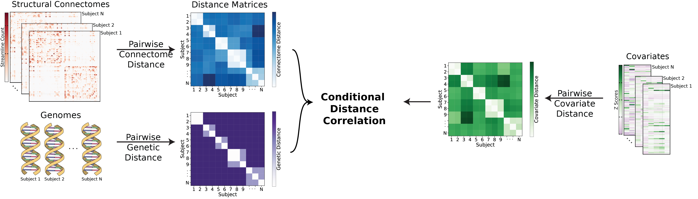

# Heritability of Human Structural Connectomes

## Jaewon Chung

_(he/him)_ - [NeuroData lab](https://neurodata.io/)
_Johns Hopkins University - Biomedical Engineering_

 [_j1c@jhu.edu_](mailto:j1c@jhu.edu)
 [_@j1c (Github)_](https://github.com/j1c)
 [_@j1c (Twitter)_](https://twitter.com/j1c)

---

# Outline

- Background
  - **What is heritability?**
  - Graphs, networks, connectomes
  - Where do connectomes come from?
- Problem
  - What are we trying to estimate?
  - Causal models
  - Dcorr
  - Distance functions
- Results
  - Dataset
  - Results 1
  - Results 2
  - Results 3

---

# What is heritability?

- Variations in phenotype caused by variations in genotype.
- Potentially discover relationships between diseases and genetics.

      

## Are the brain connectivity patterns heritable?

---

# Brains connectivity as connectomes
<!-- (aka networks or graphs) -->

- Vertex: region of interest
- Edges: connectivity measure between a pair of vertices
- Diffusion MRI: # of estimated neuronal fibers
- Undirected: neurons have no direction

<footer>
Image from Gu, Zijin, et al. "Heritability and interindividual variability of regional structure-function coupling." (2021)
</footer>

---

# How do we get structural connectomes?

 

---

# Heritability as causal problem

---

# Do genomes affect connectomes?

- Hypothesis:
  $H_0: F($Connectome|Genome$) = F($Connectome$)$
  $H_A: F($Connectome|Genome$) \neq F($Connectome$)$

- Alternatively:
  $H_0: F($Connectome, Genome$) = F($Connectome$)F($Genome$)$
  $H_A: F($Connectome, Genome$) \neq F($Connectome$)F($Genome$)$

- Known as independence testing
- Test statistic: *distance correlation (dcorr)*

---

# What is distance correlation?

- Measures dependence between two multivariate quantities.
  - For example: connectomes, genomes.
- Can detect nonlinear associations.
- Measures correlation between pairwise distances.

---

# How to compare genomes?
- Typical twin studies do not sequence genomes.
- Coefficient of kinship ($\phi_{ij}$)
  -  Probabilities of finding particular genes as identical among subjects.

- d(Genome$_i$, Genome$_j$) = 1 - 2\phi_{ij}$.

---

# How to compare connectomes?
- Statistical modelling of connectomes!
-

- d(Connectome$_i$, Connectome$_j$) = $||X^{(i)} - X^{(j)}R||_F$

Insert picture of rdpg embeddings

---

# Human Connectome Project

- Brain scans from identical (monozygotic), fraternal (dizygotic), non-twin siblings.

<footer>
Van Essen, David C., et al., The WU-Minn human connectome project: an overview (2013)
</footer>

---

# Monozygotic vs Dizygotic

- Assumptions:
  - Controls environment variable

Insert figure

---

# All three groups

- Assumptions:
  - Add in environmental and genetic variance

Insert figure

---

# Neuroanatomy (effect mediator)

- Literature show neuroanatomy (e.g. brain volume) is highly heritable.
- Want to test:
  $H_0: F($Neuroanatomy, Genome$) = F($Neuroanatomy$)F($Genome$)$
  $H_A: F($Neuroanatomy, Genome$) \neq F($Neuroanatomy$)F($Genome$)$

---

# New DAG

One with neuroanatomy

---

# Statistical problem

- Want a conditional independence test!
  $H_0: F($Conn., Genome|Neuro.$) = F($Conn.|Neuro.$)F($Genome|Neuro.$)$
  $H_A: F($Conn., Genome|Neuro.$) \neq F($Conn.|Neuro.$)F($Genome|Neuro.$)$

- Test statistic: Conditional distance correlation (cdcorr)

---

# What is conditional distance correlation?

- Augment distance correlation procedure with third distance matrix.
- d(Neuroanatomy$_i$, Neuroanatomy$_j$) = ||Neuroanatomy$_i$ - Neuroanatomy$_j$||$_F$

 

---

# Conditional Test as causal effect estimator

-

---

# Summary

- Present a causal model for heritability of connectomes.
- Leveraged recent advances:
  1. Statistical models for networks, allowing meaningful comparison of connectomes.
  2. Distance and conditional distance correlation as test statistic for causal analysis$^1$.

<footer>

$^1$ Bridgeford, Eric W., et al. "Batch Effects are Causal Effects: Applications in Human Connectomics."  (2021).

</footer>

---
# Acknowledgements

#### Team

Mike Powell

Eric Bridgeford

Carey Priebe

Joshua Vogelstein

---

         

# Additional slides

---

# Shortcomings - Network model
- Problems with connectome estimation.
  - Inability to determine the precise origin/termination of connections in the cortex.
    - -> false negatives
  - Crossing fibers
    - -> false positives
- RDPG can only represent subset of independent edge networks.

---

# Shortcomings - Model assumptions
- No interaction between genome and environment
- No epistatsis
  - Effect of one gene is dependent on another
  - Ex: black hair and baldness
- No dominance effects
- Strong assumptions in genetic distances

---

# What are environemtal effects?

- Shared
  - Common experiences of siblings living in the same household.
    - household income, the family’s living situation, the dynamics between the parents, food consumed
- Non-shared
  - Everything else
  - Epigenetics
  - Luck
  - schools, peers

---

# Random dot product graphs

---

---

---